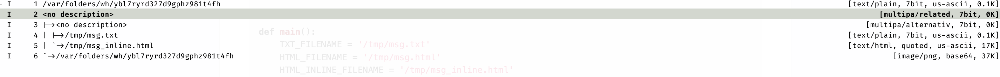

# neomutt-markdown-multipart

Composing a `multipart/related` or `multipart/alternative` email quicky by markdown format.

It supports inline images, tables, list etc or other `pandoc` markdown format.

# Dependencies

This script needs `python3` and `pandoc`, so that you must install them .

If you use osx system, you can install them by `brew install python3` and `brew install pandoc`

# Usage

1. Copy the "markdown.py" file to your `/opt/bin/` or wherever is your wanted directory.
1. Link the script to your executable path. example: `ln -s  /opt/bin/markdownmail.py /usr/local/bin/markdownmail`
1. Copy "email.html" and "styles.html" files to your `~/.local/share/templates/`.
1. Add the following line to your .muttrc so that you can convert a markdown to multipart email.

   ```
   macro compose m \
   "<pipe-message>markdownmail<enter>\
   <enter-command>source /tmp/msg.macro<enter>" \
   "Convert markdown to HTML5 and multipart content types"
   
   ```

Now, on the email sending screen (when you already wrote the markdown text and saved it) type `m`. The markdown text file was converted to multipart attachments (Maby be multipart/alternative or multipart/related). The related inline image was attached too. (Note: The markdonw image path must be absolute.)



# Issues

1. You might need to make the script executable if you have error about permissions.
1. If your markdown file contains inline images, the path must be absolute.


# References

https://github.com/anufrievroman/Neomutt-File-Picker/blob/master/filepicker
